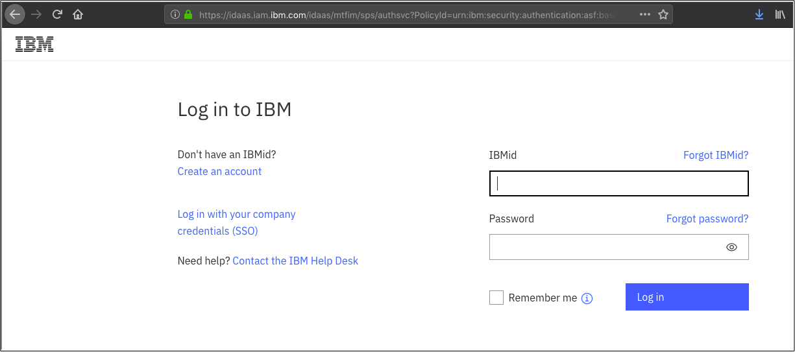
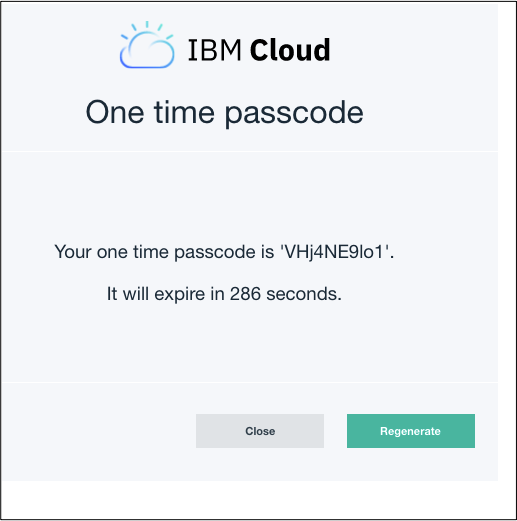

<!-- START doctoc generated TOC please keep comment here to allow auto update -->
<!-- DON'T EDIT THIS SECTION, INSTEAD RE-RUN doctoc TO UPDATE -->


- [Overview](#overview)
  - [Target audience](#target-audience)
  - [Prerequisites](#prerequisites)
  - [Installing CLI](#installing-cli)
    - [Installing plugins](#installing-plugins)
  - [CLI Authentication](#cli-authentication)
    - [Generating an API Key](#generating-an-api-key)
    - [Set environmental variable](#set-environmental-variable)
    - [setting resource group, region, space](#setting-resource-group-region-space)
  - [Use the ibmcloud dev plugin to deploy a starter app + cloudant](#use-the-ibmcloud-dev-plugin-to-deploy-a-starter-app--cloudant)
  - [frontend options?](#frontend-options)
  - [Tie in to logging and metrics](#tie-in-to-logging-and-metrics)
  - [Deployment options (devops,source control)](#deployment-options-devopssource-control)

<!-- END doctoc generated TOC please keep comment here to allow auto update -->

# Overview
Today I will be showing you how to get up and running with deploying a simple application backed by a hosted IBM Cloud service. 

## Target audience

## Prerequisites

 - [An IBM Cloud Account](https://console.bluemix.net)
 - Access to Linux or macOS terminal

## Installing CLI

You have a few options for how you would like to install the IBM Cloud CLI: 

1. Download and install the [binary version](https://console.bluemix.net/docs/cli/reference/ibmcloud/download_cli.html#install_use). If you're comfortable unziping files and understand how to move binaries in to your `PATH` then this is the option for you. 
2. Run the [one-line installer](https://console.bluemix.net/docs/cli/index.html#step1). This will also install some IBM Cloud Plugins as well as tools to interact with Kubernetes and Docker. See [here](https://console.bluemix.net/docs/cli/index.html#overview) for the full list of installed components. 
3. Use [bxshell](https://github.com/l2fprod/bxshell) which is run as a local Docker container that has the CLI and tools baked in. Pretty handy for kicking the tires. 

### Installing plugins
If you choose option 1 in the previous step you will also need to install a few plugins to follow along with this tutorial.

```sh
$ ibmcloud plugin install dev -r 'IBM Cloud'
$ ibmcloud plugin install container-service/kubernetes-service -r 'IBM Cloud' 
$ ibmcloud plugin install container-registry -r 'IBM Cloud'
```

With the CLI and plugins installed we can move on to logging in to the CLI and getting our environment configured. 

## CLI Authentication
It is not considered best practice to log in to the CLI using your IBMid username and password, so we will invode the `--sso` option which will open a browser window for account log in. Once you have logged in to the account via the browser you will be redirected to a page that has a one-time passcode to use for authentication. 

```
$ ibmcloud login --sso
API endpoint: https://api.ng.bluemix.net

Get One Time Code from https://iam-id-2.eu-gb.bluemix.net/identity/passcode to proceed.
Open the URL in the default browser? [Y/n]>Y
```





Once we've got the code we hop back to the terminal and complete the log in process. 

```
One Time Code > 
Authenticating...
OK

Select an account:
1. Ryan Tiffany's Account (xxxxxxxxxxxxxxxxxxxxxxx) <-> 228638
2. Mouserat Account (xxxxxxxxxxxxxxxxxxxxxxx)
3. IBM (xxxxxxxxxxxxxxxxxxxxxxx) <-> 78003
Enter a number> 3
Targeted account IBM (xxxxxxxxxxxxxxxxxxxxxxx) <-> 78003

Targeted resource group default


API endpoint:      https://api.ng.bluemix.net
Region:            us-south
User:              user@example.com
Account:           IBM (xxxxxxxxxxxxxxxxxxxxxxx) <-> 78003
Resource group:    default
CF API endpoint:
Org:
Space:
```

### Generating an API Key
Since we've already touched on not wanting to use IBMid and password for authentication with the CLI, and generating a one-time passcode is not always practical (headless server for instance), we can create an API key that will be used for authentication instead. 

```sh
$ ibmcloud iam api-key-create <NAME OF KEY> -d "A short description of the key, i.e. 'For use on work laptop'"
```

You will need to copy and paste the key somewhere safe as it will not be displayed again. 

### Set environmental variable 

### setting resource group, region, space 

## Use the ibmcloud dev plugin to deploy a starter app + cloudant 

## frontend options? 

## Tie in to logging and metrics

## Deployment options (devops,source control)
